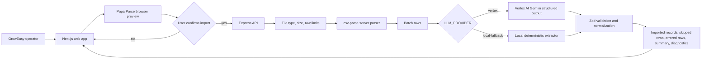

# GrowEasy CSV Importer Architecture

## System Diagram



## Design Choices

- Preview is browser-only and does not call AI. This protects cost, latency, and user control.
- The backend reparses the original CSV after confirmation. The preview result is never trusted as the source of truth.
- CRM contracts live in `Backend/shared`, so API responses and frontend rendering use the same schema.
- AI extraction is batched with bounded concurrency and retries to reduce blast radius when a batch fails.
- Every source row receives one explicit outcome: imported, skipped, or errored.
- The API uses Google Vertex AI when `LLM_PROVIDER=vertex`. The local fallback extractor is useful for tests and demos.
- No raw CSV rows or prompts are logged by the API.

## Backend Modules

```text
Backend/src
  app.ts                         Express app composition
  config/env.ts                  Environment parsing and safe defaults
  middleware/                    Request id, error, and not-found handling
  features/imports/
    import.routes.ts             Upload endpoint and Multer limits
    import.controller.ts         HTTP boundary
    import.service.ts            Import orchestration
    csv-parser.ts                Server-side CSV parsing
    ai-extractor.ts              Provider batching, retries, fallback selection
    ai/                          Vertex and fallback provider implementations
    fallback-extractor.ts        Deterministic local mapping
    normalizers.ts               Email, phone, date, status, source cleanup
    prompt.ts                    AI extraction instructions
```

## Frontend Modules

```text
Frontend/src
  app/                           Next.js App Router entry
  components/layout/             GrowEasy sidebar and shell
  components/ui/                 Reusable UI primitives
  features/import-leads/
    components/                  Workspace, modal, dropzone, tables
    hooks/                       TanStack Query mutation
    utils/                       CSV preview parser and demo/sample data
```

## Data Contract

The normalized CRM record contains:

```text
created_at, name, email, country_code, mobile_without_country_code,
company, city, state, country, lead_owner, crm_status, crm_note,
data_source, possession_time, description
```

Allowed `crm_status` values:

- `GOOD_LEAD_FOLLOW_UP`
- `DID_NOT_CONNECT`
- `BAD_LEAD`
- `SALE_DONE`

Allowed `data_source` values:

- `leads_on_demand`
- `meridian_tower`
- `eden_park`
- `varah_swamy`
- `sarjapur_plots`
- blank when not confident

## Security Boundaries

- CSV files contain PII. The API avoids raw row logging.
- Upload size and row limits are enforced before AI extraction.
- CORS is restricted through `CORS_ORIGIN`.
- Vertex credentials are server-only and never exposed to the browser.
- `crm_note` values are normalized into one-line strings to avoid accidental CSV row breaks in future exports.
- The backend validates AI output with Zod before returning records.
- Browser and server CSV parsing both reject empty headers and duplicate headers before AI extraction.
- CSV parsing detects comma, semicolon, and tab delimiters and strips UTF-8 BOM headers.

## Failure Handling

- Invalid file type returns `415`.
- Oversized upload returns `413`.
- CSV parse errors return `400`.
- AI batch failures retry with jitter. If still failing, affected rows are returned as errored with diagnostics.
- Rows with neither email nor mobile are skipped.
- Rows not returned by the extractor are errored with a clear reason.
