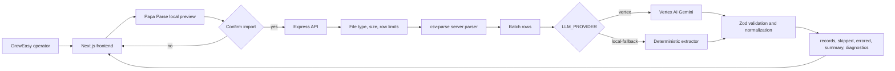

# GrowEasy CSV Importer

GrowEasy CSV Importer turns lead-export spreadsheets into GrowEasy CRM records.
The browser previews the CSV first, waits for user confirmation, then sends the
original file to a Node API for extraction, validation, and normalization.

The project is built for the assignment requirements: drag-and-drop upload,
incremental preview parsing, processing progress, retries for failed extraction
batches, virtualized tables, dark mode, tests, Docker, and deployment notes.

## Table of Contents

- [Product Flow](#product-flow)
- [Tech Stack](#tech-stack)
- [Architecture](#architecture)
- [Project Structure](#project-structure)
- [Local Setup](#local-setup)
- [Environment Variables](#environment-variables)
- [Useful Commands](#useful-commands)
- [Docker](#docker)
- [Deployment](#deployment)
- [API Reference](#api-reference)
- [Testing and Quality](#testing-and-quality)
- [Security Notes](#security-notes)

## Product Flow

1. A user uploads or drops a CSV in the Lead Sources screen.
2. The frontend parses the CSV in the browser with Papa Parse and shows a
   virtualized preview table. No backend or AI call runs during preview.
3. The user confirms the import.
4. The frontend sends the original CSV file to the API.
5. The backend validates the upload, reparses the CSV, splits rows into
   bounded batches, and extracts CRM records through Vertex AI or the local
   fallback extractor.
6. The backend validates every result with shared Zod schemas.
7. Manage Leads shows imported, skipped, and errored rows with search, filters,
   summary cards, and virtualized tables.

## Tech Stack

| Layer | Stack |
| --- | --- |
| Frontend | Next.js App Router, React 19, TypeScript, Tailwind CSS v4 |
| UI | Lucide icons, React Dropzone, custom Aceternity-style upload surface, custom dark-mode tokens |
| Data UI | TanStack Table with custom fixed-row virtualization |
| CSV preview | Papa Parse in the browser with incremental row callbacks |
| API | Node.js 22, Express 5, TypeScript, Multer, csv-parse |
| AI extraction | Google Gen AI SDK for Vertex AI Gemini, plus deterministic `local-fallback` mode |
| Validation | Zod schemas shared through `Backend/shared` |
| Runtime safety | Helmet, CORS allowlist, rate limiting, compression, upload size and row limits |
| Testing | Vitest, React Testing Library, Supertest, jsdom |
| Build tooling | tsup, TypeScript, ESLint |
| Deployment | Docker, Docker Compose, Vercel frontend, Render/Railway API |

## Architecture



### Frontend Boundaries

- `Frontend/src/app` owns the Next.js route and global CSS tokens.
- `Frontend/src/components` contains shared UI, layout, theme, toast, and table
  primitives.
- `Frontend/src/features/import-leads` owns the CSV intake workflow,
  preview parser, modal, review filters, result tables, demo CSV generation,
  and feature tests.
- `Frontend/src/lib/api.ts` contains the API client boundary.

### Backend Boundaries

- `Backend/src/app.ts` composes Express middleware, health checks, and routes.
- `Backend/src/features/imports/import.routes.ts` owns multipart upload limits.
- `Backend/src/features/imports/import.controller.ts` handles HTTP request and
  response mapping.
- `Backend/src/features/imports/import.service.ts` orchestrates parsing,
  extraction, normalization, and response validation.
- `Backend/src/features/imports/ai-extractor.ts` handles provider selection,
  batching, bounded concurrency, retries, and diagnostics.
- `Backend/src/features/imports/normalizers.ts` cleans model output into the CRM
  contract.
- `Backend/shared` publishes CRM constants, Zod schemas, and TypeScript types
  used by both frontend and backend.

### Data Contract

The normalized CRM record contains these fields:

```text
created_at, name, email, country_code, mobile_without_country_code,
company, city, state, country, lead_owner, crm_status, crm_note,
data_source, possession_time, description
```

Every source row ends in one outcome:

- `records`: rows imported into the CRM review table
- `skipped`: rows rejected for data reasons, such as missing contact details
- `errored`: rows that failed processing after retries or provider failures

## Project Structure

```text
.
├── Backend/
│   ├── src/                 Express API, import pipeline, middleware
│   ├── shared/              Shared Zod schemas, constants, generated types
│   └── .env.example         Backend runtime configuration template
├── Frontend/
│   ├── src/app/             Next.js App Router entry and global CSS
│   ├── src/components/      Layout, UI primitives, theme, toast provider
│   ├── src/features/        Import leads feature and tests
│   └── .env.example         Frontend public API URL template
├── Docs/
│   ├── README.md            Detailed developer reference
│   ├── ARCHITECTURE.md      Deeper architecture notes
│   ├── Context.md           Working project context and change log
│   └── package.json         Root orchestration scripts
├── Dockerfile.backend
├── Dockerfile.frontend
├── docker-compose.yml
└── render.yaml
```

## Local Setup

### Prerequisites

- Node.js `>=22`
- npm
- Docker Desktop, Colima, or another Docker daemon if you want Docker runs
- Google Cloud credentials only when running `LLM_PROVIDER=vertex`

### Install Dependencies

Run setup from the repository root:

```bash
npm --prefix Docs run setup
```

The setup script installs dependencies for `Docs`, `Backend/shared`, `Backend`,
and `Frontend`, then builds the shared package.

### Configure Environment Files

Create local env files when you need custom values:

```bash
cp Backend/.env.example Backend/.env
cp Frontend/.env.example Frontend/.env.local
```

For local work without cloud credentials, set this in `Backend/.env`:

```bash
LLM_PROVIDER=local-fallback
```

For Vertex AI, keep:

```bash
LLM_PROVIDER=vertex
VERTEX_PROJECT_ID=alien-slice-499511-f8
VERTEX_LOCATION=global
VERTEX_MODEL=gemini-2.5-flash
```

Vertex uses Google Application Default Credentials or
`GOOGLE_APPLICATION_CREDENTIALS` on the API server. Do not place service-account
JSON files in the repository.

### Run the App

```bash
npm --prefix Docs run dev
```

Local URLs:

- Frontend: `http://127.0.0.1:3000`
- API: `http://localhost:4000`
- API health: `http://localhost:4000/health`

## Environment Variables

| Variable | Default | Scope | Purpose |
| --- | --- | --- | --- |
| `PORT` | `4000` | Backend | API port |
| `CORS_ORIGIN` | `http://localhost:3000,http://127.0.0.1:3000` | Backend | Allowed browser origins |
| `MAX_UPLOAD_MB` | `10` | Backend | CSV upload size limit |
| `MAX_CSV_ROWS` | `5000` | Backend | Server-side row limit |
| `AI_BATCH_SIZE` | `25` | Backend | Rows sent per extraction batch |
| `AI_BATCH_CONCURRENCY` | `2` | Backend | Parallel extraction batches |
| `AI_MAX_RETRIES` | `2` | Backend | Retry count for failed batches |
| `LLM_PROVIDER` | `vertex` | Backend | `vertex` or `local-fallback` |
| `VERTEX_PROJECT_ID` | `alien-slice-499511-f8` | Backend | Google Cloud project |
| `VERTEX_LOCATION` | `global` | Backend | Vertex AI location |
| `VERTEX_MODEL` | `gemini-2.5-flash` | Backend | Gemini model ID |
| `NEXT_PUBLIC_API_URL` | `http://localhost:4000` | Frontend | Public API base URL |

## Useful Commands

Run commands from the repository root.

| Command | Purpose |
| --- | --- |
| `npm --prefix Docs run setup` | Install all workspaces and build shared contracts |
| `npm --prefix Docs run dev` | Start frontend and backend together |
| `npm --prefix Docs run typecheck` | Typecheck shared, backend, and frontend |
| `npm --prefix Docs run lint` | Lint shared, backend, and frontend |
| `npm --prefix Docs run test` | Build shared package and run backend/frontend tests |
| `npm --prefix Docs run build` | Build shared, backend, and frontend |
| `npm --prefix Docs run audit:prod` | Check production dependencies for high or critical advisories |

Targeted commands:

```bash
npm --prefix Backend run dev
npm --prefix Backend run test
npm --prefix Frontend run dev
npm --prefix Frontend run test
npm --prefix Frontend run build
```

## Docker

Build the API image:

```bash
docker build -f Dockerfile.backend -t groweasy-api .
```

Build the frontend image:

```bash
docker build \
  -f Dockerfile.frontend \
  --build-arg NEXT_PUBLIC_API_URL=http://localhost:4000 \
  -t groweasy-web .
```

Run the full stack:

```bash
docker compose up --build
```

The Compose file runs the API with `LLM_PROVIDER=local-fallback` by default, so
the stack can boot without Google Cloud credentials. Set Vertex env values on
the API service when you want hosted AI extraction.

## Deployment

### Recommended Hosting Split

- Frontend: Vercel project rooted at `Frontend`
- API: Render or Railway using `Dockerfile.backend`
- Contracts: `Backend/shared` builds during install/build commands

### Vercel Frontend

1. Create a Vercel project for `Frontend`.
2. Set `NEXT_PUBLIC_API_URL` to the deployed API URL.
3. Use the frontend build command:

   ```bash
   npm run build
   ```

4. After deployment, upload a CSV and confirm that the API receives confirmed
   imports.

### Render API

1. Push the repository to GitHub.
2. Create a Render Blueprint from `render.yaml`, or create a Web Service from
   `Dockerfile.backend`.
3. Set `CORS_ORIGIN` to the deployed Vercel URL.
4. Set Vertex credentials through the API hosting environment, or use
   `LLM_PROVIDER=local-fallback` for a deterministic demo.
5. Verify the deployed API:

   ```bash
   curl https://<api-host>/health
   ```

### Railway API

1. Create a Railway service from the repository.
2. Use the backend Dockerfile or the backend build/start scripts.
3. Set `PORT`, `CORS_ORIGIN`, and LLM provider variables.
4. Verify `/health` before connecting the Vercel frontend.

## API Reference

### `GET /health`

Returns:

```json
{
  "status": "ok",
  "service": "groweasy-api"
}
```

### `POST /api/imports/extract`

Accepts multipart form data:

- field name: `file`
- file type: `.csv`
- default max size: `10MB`

Response:

```ts
{
  records: CrmLeadRecord[];
  skipped: SkippedRecord[];
  errored: ErroredRecord[];
  summary: {
    totalRows: number;
    imported: number;
    skipped: number;
    errored: number;
    batches: number;
    durationMs: number;
    aiProvider: "vertex" | "local-fallback";
  };
  diagnostics: BatchDiagnostic[];
}
```

## Testing and Quality

Current test coverage includes:

- Browser CSV preview parsing and delimiter detection
- Incremental parsing progress
- Drag-and-drop upload behavior
- Virtualized preview table behavior
- Theme persistence and animated theme toggle behavior
- Toast behavior
- Lead search and filters
- Backend CSV parsing and normalization
- Import API behavior with Supertest
- Local fallback extraction for supported lead export shapes

Run the full verification set:

```bash
npm --prefix Docs run typecheck
npm --prefix Docs run lint
npm --prefix Docs run test
npm --prefix Docs run build
npm --prefix Docs run audit:prod
docker compose config
```

## Security Notes

- The browser never receives Vertex credentials.
- The backend enforces upload type, upload size, row count, and CORS limits.
- The API uses Helmet, rate limiting, and request-scoped error handling.
- The backend reparses the original CSV after confirmation and treats browser
  preview data as untrusted.
- AI output must pass Zod validation before the API returns records.
- Raw CSV rows and prompts should not be logged because lead files contain PII.

## More Documentation

- [Docs/README.md](Docs/README.md) covers detailed setup, environment, API,
  Docker, and deployment notes.
- [Docs/ARCHITECTURE.md](Docs/ARCHITECTURE.md) covers the system diagram,
  module boundaries, data contract, and failure handling.
- [Docs/Context.md](Docs/Context.md) records implementation decisions and recent
  project changes.
